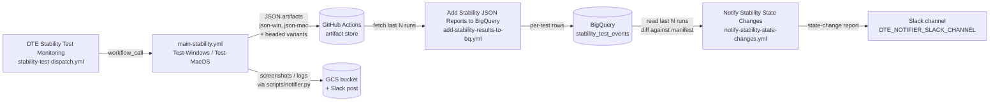

# Automated Stability / Flakiness Monitoring

We use three coordinated GitHub Actions workflows to measure how stable our test suite is over time, persist the raw per-test outcomes in BigQuery, and ping the team in Slack when a test changes state (e.g. a previously-passing test starts failing, or a previously-flaky test stabilises).

| # | Workflow name | File | Trigger |
|---|---|---|---|
| 1 | DTE Stability Test Monitoring | [`.github/workflows/stability-test-dispatch.yml`](.github/workflows/stability-test-dispatch.yml) | `workflow_dispatch` |
| 2 | Add Stability JSON Reports to BigQuery | [`.github/workflows/add-stability-results-to-bq.yml`](.github/workflows/add-stability-results-to-bq.yml) | `workflow_dispatch` |
| 3 | Notify Stability State Changes | [`.github/workflows/notify-stability-state-changes.yml`](.github/workflows/notify-stability-state-changes.yml) | `workflow_dispatch` |

## Flow

The three workflows are run on demand and feed into each other: (1) produces JSON reports, (2) ingests those reports, (3) reads the ingested data and notifies humans.

---

## 1. DTE Stability Test Monitoring

**File:** [`.github/workflows/stability-test-dispatch.yml`](.github/workflows/stability-test-dispatch.yml)

Dispatch workflow that runs the test suite (filtered by category/split) on one or more platforms in order to measure stability. It is the source of the raw JSON reports the other two workflows depend on.

It delegates the actual test execution to [`.github/workflows/main-stability.yml`](.github/workflows/main-stability.yml), which runs each test set **twice** per platform — once headless and once headed — with `--reruns 0` (no retries, so flakiness is visible).

### Inputs

| Input | Default | Accepted values | Purpose |
|---|---|---|---|
| `platform` | `all` | `all`, `win`, `mac`, `linux` (substring match) | Which OS runners to fan out to. `all` triggers both the Windows and macOS jobs. The value is matched with `contains()`, so a value like `win` runs only Windows. |
| `category` | `pass` | `pass`, `flaky`, `unstable` (and any value used in `manifests/key.yaml`) | Which `result` category in `manifests/key.yaml` to select tests from. Surfaces as `STARFOX_CATEGORY` and is consumed by `scripts/choose_test_split.py`. `pass` (the default) runs the tests currently expected to be stable so we can detect regressions. |
| `split` | `all` | `all`, `functional1`, `functional2`, … (any `splits` value in the manifest) | Which split of the suite to run. Surfaces as `STARFOX_SPLIT`. `all` lets `choose_test_split.py` pull from every split. |

### What it does

1. Fans out into one job per requested platform (`Run-Starfox-Win`, `Run-Starfox-Mac`), each calling `main-stability.yml`.
2. `main-stability.yml`:
   - Installs pipenv deps and downloads the current Firefox build via `scripts/collect_executables`.
   - Forces `TESTRAIL_REPORT=false` / `REPORTABLE=false` — stability runs **never** write to TestRail.
   - Runs `scripts/choose_test_split.py` to filter `manifests/key.yaml` by `STARFOX_CATEGORY` + `STARFOX_SPLIT` and writes the result to `selected_tests`.
   - Executes pytest on `selected_tests` with `--json-report` and `--reruns 0`, producing `report-{platform}.json`.
   - Repeats the pytest run with the headed pyproject (`config/ci_pyproject_headed_no_reruns.toml`), producing `report-{platform}-headed.json`.
   - Uploads four artifacts per platform: `json-{platform}`, `json-{platform}-headed`, and an `artifacts-{platform}` bundle of screenshots/logs.
3. A follow-up `Use-Artifacts-*` job runs `scripts/notifier.py`, which uploads the artifact bundle to GCS and posts a Slack notification with links.

These artifacts are the input for workflow #2.

---

## 2. Add Stability JSON Reports to BigQuery

**File:** [`.github/workflows/add-stability-results-to-bq.yml`](.github/workflows/add-stability-results-to-bq.yml)

Pulls the JSON reports from the N most recent runs of `stability-test-dispatch.yml` and inserts one row per (run, platform, test) into BigQuery, building the dataset that workflow #3 reads from.

### Inputs

| Input | Default | Type | Purpose |
|---|---|---|---|
| `runs` | `5` | string (int) | How many recent runs of the dispatch workflow to ingest. Larger values import more history in one go. Surfaces as `D_RUNS`. |
| `platform` | `all` | `all` / `win` / `mac` | Which platform's JSON artifacts to ingest. Controls which artifact names are downloaded (`json-win`, `json-mac`). |
| `include_headed` | `false` | boolean | If true, also ingests the `*-headed` artifacts and marks those rows with `headed=true` in BigQuery. |

### What it does

Driven by [`scripts/add_stability_json_to_bq.py`](scripts/add_stability_json_to_bq.py):

1. Authenticates to GCP using `secrets.GC_CREDENTIAL_STABILITY`.
2. Uses the GitHub Actions REST API to find the most recent `D_RUNS` runs of `stability-test-dispatch.yml`.
3. For each matching run, downloads the JSON artifacts whose names are allowed by the `platform` + `include_headed` filter.
4. Ensures the destination BigQuery table (`BQ_PROJECT.BQ_DATASET.BQ_TABLE`, defaulting to `stability_test_events`) exists with the expected schema.
5. Flattens each pytest JSON report into per-test rows (`test_nodeid`, `outcome`, `duration`, `platform`, `headed`, `run_id`, `run_created_at`, etc.) and streams them into BigQuery.

This is the system of record the notifier relies on.

---

## 3. Notify Stability State Changes

**File:** [`.github/workflows/notify-stability-state-changes.yml`](.github/workflows/notify-stability-state-changes.yml)

Reads the recently-ingested rows from BigQuery, compares them against `manifests/key.yaml`, and posts a Slack message naming tests whose stability state has changed.

### Inputs

| Input | Default | Type | Purpose |
|---|---|---|---|
| `platform` | `mac` | choice: `mac`, `win` | Which platform's runs to analyse. Unlike the other two workflows, this one runs one platform at a time (no `all`, no `linux`). |
| `runs` | `5` | string (int) | How many recent runs to include in the analysis window. |
| `include_headed` | `false` | boolean | If true, includes headed runs in the analysis. |

### What it does

Driven by [`scripts/notify_stability_state_changes.py`](scripts/notify_stability_state_changes.py):

1. Authenticates to GCP and reads the latest `RUNS` runs for the selected `PLATFORM` from the BigQuery table populated by workflow #2.
2. Loads `manifests/key.yaml` so the manifest's declared state for each test (`pass`, `unstable`, `flaky`, etc.) is known.
3. For each test in scope, normalises its pytest node id (`canonical_manifest_key`) and compares the observed outcomes across the window with what the manifest claims.
4. Identifies state changes — e.g. a test marked `pass` that is now failing in the window, or a test marked `unstable` that has been green for the window.
5. Formats the changes into Slack blocks (capped at `MAX_SLACK_BLOCKS` for safety) and posts them to `${{ vars.DTE_NOTIFIER_SLACK_CHANNEL }}`, mentioning `${{ vars.DTE_NOTIFIER_SLACK_USER_GROUP_HANDLE }}`.

The Slack message is the human-facing output of the whole pipeline; the DTE team uses it to decide which entries in `manifests/key.yaml` to flip.

---

## Required secrets and variables

| Name | Used by | Purpose |
|---|---|---|
| `SVC_ACCT_DECRYPT` | #1 (in `main-stability.yml`) | Decrypts test account secrets used during the test run. |
| `SLACK_KEY` | #1 (notifier), #3 | Slack bot token. |
| `GCP_CREDENTIAL` | #1 (notifier) | GCS service account for uploading run artifacts. |
| `GC_CREDENTIAL_STABILITY` | #2, #3 | BigQuery service account used by the ingest and notifier scripts. |
| `BQ_PROJECT` / `BQ_DATASET` / `BQ_TABLE` | #2, #3 | Destination / source BigQuery table for stability events. |
| `vars.DTE_NOTIFIER_SLACK_CHANNEL` | #3 | Slack channel that the state-change report is posted to. |
| `vars.DTE_NOTIFIER_SLACK_USER_GROUP_HANDLE` | #3 | Slack user group pinged in the state-change report. |
